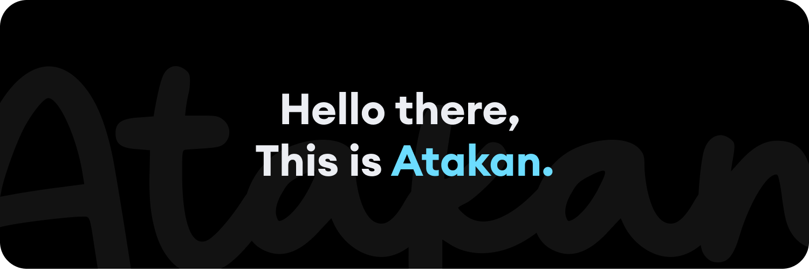

 
Hey there, human! I am Atakan, a seasoned Full Stack Web Developer, and I hail from the earth (Originally from 🇹🇷 Turkey, currently in 🇵🇭 Philippines). My expertise lies in crafting intricate solutions on the vast landscape of the web, with a particular focus on WordPress development.

Despite holding a degree in sociology – the study of humanity's intricacies – I have found my true passion lies in the meticulous process of untangling, investigating, and rectifying code-related challenges rather than delving into the complexities of societal enigmas.

Since the inception of my coding journey in 2011, I have been dedicated to the creation of websites and web applications, navigating the digital realm with the precision of a determined artisan. My primary focus is on conjuring WordPress enchantment tailored for businesses, ranging from fledgling startups to distinguished enterprises.

Allow me to impart a touch of wisdom with my favorite quote:

> We have two hands and one mouth so that we can write code twice as much as we speak.
> (Originally from Epictetus)

 

---

#### 📋 Languages:

#### 📚 Frameworks, Platforms and Libraries

#### IDE:

#### Testing:

#### Version Control:

#### ☁️ Hosting/SaaS

#### 🎨 Design

### Personal Projects & Website

Personal Website: [https://www.atakanoz.com](https://www.atakanoz.com). 
✈️ Travelkoa: [https://www.travelkoa.com](https://www.travelkoa.com). 
🍵 Teapong: [https://www.teapong.com](https://www.teapong.com).

#### Connect

